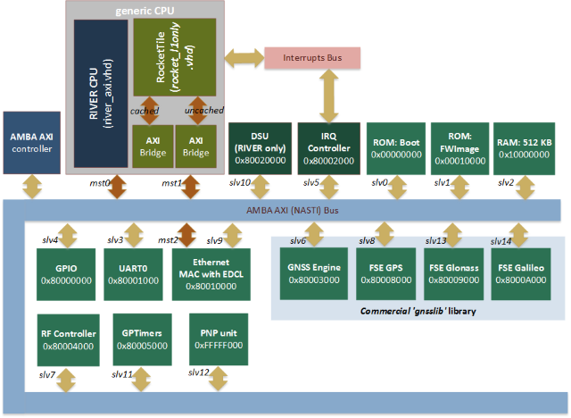
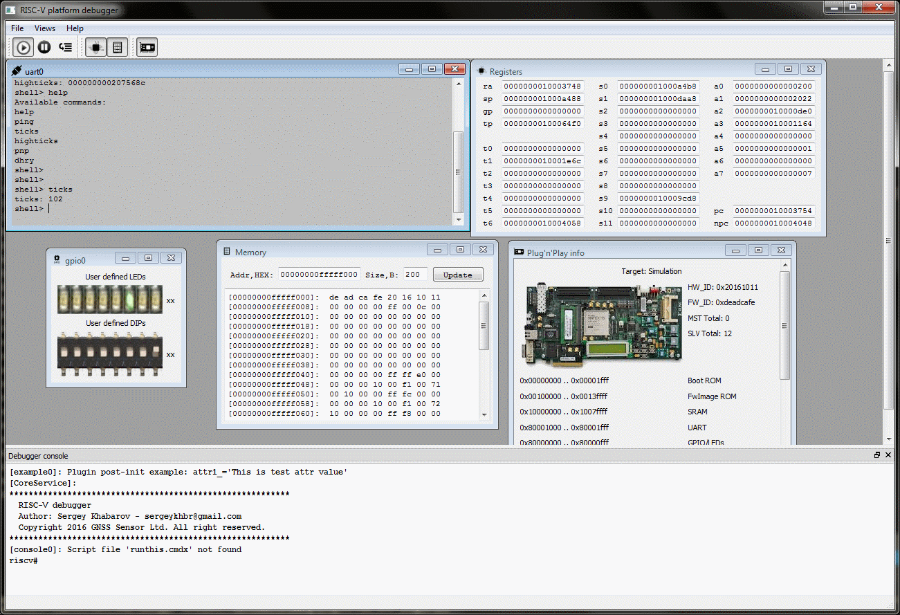
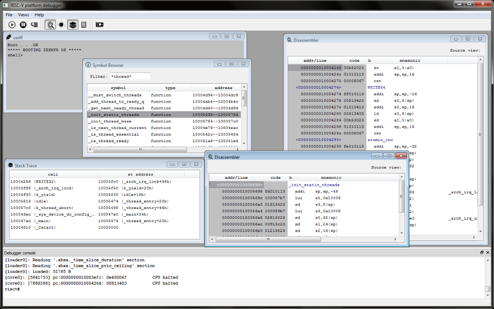

System-On-Chip template based on Rocket-chip (RISC-V ISA). VHDL implementation.
=====================

This repository provides open source System-on-Chip implementation based on
64-bits CPU "Rocket-chip" distributed under BSD license. SOC source files
either include general set of peripheries, FPGA CADs projects files, own
implementation of the Windows/Linux debugger and several examples that help
to run your firmware on almost any FPGA boards.
Satellite Navigation (GPS/GLONASS/Galileo) modules were stubbed in this
repository and can be requested on
[gnss-sensor.com](http://www.gnss-sensor.com).


## What is Rocket-chip and [RISC-V ISA](http://www.riscv.org)?

RISC-V (pronounced "risk-five") is a new instruction set architecture (ISA)
that was originally designed to support computer architecture research and
education and is now set become a standard open architecture for industry
implementations under the governance of the RISC-V Foundation. RISC-V was
originally developed in the Computer Science Division of the EECS Department
at the University of California, Berkeley.

Parameterized generator of the Rocket-chip can be found here:
[https://github.com/ucb-bar](https://github.com/ucb-bar)

## System-on-Chip structure and performance

SoC documentation in [.pdf](rocket_soc/docs/riscv_soc_descr.pdf) and 
[.html](http://sergeykhbr.github.io/riscv_vhdl/) formats.



Performance analysis is based on
[**Dhrystone v2.1. benchmark**](http://fossies.org/linux/privat/old/dhrystone-2.1.tar.gz/)
that is very compact and entirely ported into Zephyr shell example.
You can run it yourself and verify results (see below).

**RISC-V Instruction simulator** - always one instruction per clock.  
**FPGA SOC based on "Rocket" CPU** - single core/single issue 64-bits CPU
with disabled L1toL2 interconnect (Verilog generated from Scala sources).  
**FPGA SOC based on "River" CPU** - single core/single issue 64-bits CPU is my own
implementation of RISC-V ISA (VHDL with SystemC as reference).  


Target | usec per<br> 1 dhry | Dhrystone<br> per sec | MHz,<br> max | FPU | OS | Optim.
-------|:-------------------:|:---------------------:|:------------:|:---:|----|----
RISC-V simulator v3.1       | 12.0 | **77257.0** | -   | No  | Zephyr 1.3 | -O2
FPGA SoC with "Rocket" v3.1 | 28.0 | **34964.0** | 60  | No  | Zephyr 1.3 | -O2
FPGA SoC with "Rocket" v4.0 | 40.7 | **24038.0** | 60<sup>1</sup>  | Yes | Zephyr 1.5 | -O2
FPGA SoC with "River " v4.0 | 28.0 | **35259.0** | 60<sup>1</sup>  | No | Zephyr 1.5 | -O2
RISC-V simulator v5.1       | 12.0 | **65652.0** | -   | No  | Zephyr 1.6 | -O0
RISC-V simulator v5.1       | 12.0 | **76719.0** | -   | No  | Zephyr 1.6 | -O2
FPGA SoC with "Rocket" v5.1 | 41.0 | **23999.0** | 60<sup>1</sup>  | Yes | Zephyr 1.6 | -O2
FPGA SoC with "River" v5.1  | 28.0 | **35121.0** | 60<sup>1</sup>  | No | Zephyr 1.6 | -O2
FPGA SoC with "LEON3" SPARC | 20.0 | **48229.0** | 60  | No | Bare metal | -O0
FPGA SoC with "LEON3" SPARC | 8.0 | **119515.0** | 60  | No | Bare metal | -O2

<sup>1</sup> - Actual SoC frequency is 40 MHz (to meet FPU constrains) but
Dhrystone benchmark uses constant 60 MHz and high precision counter (in clock cycles)
to compute results in msec. Timer value doesn't depend of clock frequency. 
You can find FPGA bit-files with Rocket and River CPUs in the repository. I am
also ready to share my framework for Leon3 SPARC V8 processor (SoC and FW) by request.

Access to all memory banks and peripheries in the same clock domain is always
one clock in this SOC (without wait-states). So, this benchmark 
result (**Dhrystone per seconds**) shows performance of the CPU with integer 
instructions and degradation of the CPI relative ideal (simulation) case.

   **In my opinion compiler affects on benchmark results much more than hardware
   architecture and there's a lot of work for RISC-V compiler developers.
   So, use as new compiler as possible.**

## Repository structure

This repository consists of three sub-projects each in own subfolder:

- **rocket_soc** is the folder with VHDL/Verilog sources of the SOC
  including synthesizable processors *"Rocket"* and *"River"* and peripheries. 
  Source code is portable on almost any FPGA is due to the fact that
  technology dependant modules (like *PLL*, *IO-buffers* 
  etc) instantiated inside of "virtual" components 
  in a similar to Gailser's *[GRLIB](www.gailser.com)* way.  
  Full SOC design without FPU occupies less than 5 % of FPGA resources (Virtex6). 
  *"Rocket-chip"* CPU itself is the modern **64-bits processor 
  with L1-cache, branch-predictor, MMU and virtualization support**.  
  This sub-project also contains:
    * *fw*: directory with the bootloader and FW examples.
    * *fw_images*: directory with the ROM images in HEX-format.
    * *prj*: project files for different CADs (Xilinx ISE, ModelSim).
    * *tb*: VHDL testbech of the full system and utilities.
    * *bit_files*: Pre-built FPGA images for ML605 and KC705 boards.
- **zephyr** is the ported on RISC-V 64-bits operation system.
  Information about this Real-Time Operation System for Internet of
  Things Devices provided by [Zephyr Project](https://www.zephyrproject.org/).
  Early support for the Zephyr Project includes Intel Corporation,
  NXP Semiconductors N.V., Synopsys, Inc. and UbiquiOS Technology Limited.
- **debugger**. The last piece of the ready-to-use open HW/SW system is
  [Software Debugger (C++)](http://sergeykhbr.github.io/riscv_vhdl/sw_debugger_api_link.html)
  with the full system simulator available as a plug-in.
  Debugger interacts with the target (FPGA or Software Simulator) 
  via [Ethernet](http://sergeykhbr.github.io/riscv_vhdl/eth_link.html)
  using EDCL protocol over UDP. To provide this functionality SOC includes
  [**10/100 Ethernet MAC with EDCL**](http://sergeykhbr.github.io/riscv_vhdl/eth_link.html)
  and [**Debug Support Unit (DSU)**](http://sergeykhbr.github.io/riscv_vhdl/periphery_page_1.html)
  devices on AMBA AXI4 bus.
- **RISC-V "River" core**. It's my own implementation of RISC-V ISA that is ideal
  for embedded application with active usage of 64-bits computations
  (DSP for Satellite Navigation). I've specified the following principles for myself:
    1. Unified Verification Methodology (UVM)
        - */debugger/cpu_fnc_plugin*  - Functional RISC-V CPU model.
        - */debugger/cpu_sysc_plugin* - Precise SystemC RIVER CPU model.
        - */rocket_soc/riverlib*      - RIVER VHDL sources with VCD-stimulus from SystemC.
    2. Advanced debugging features: bus tracing, pipeline statistic (like CPI) in real-time on HW level etc.
    3. Integration with GUI from the very beginning.
  I hope to develop the most friendly synthesizable processor for HW and SW developers
  and provide debugging tools of professional quality.


# Step I: Simple FPGA test.

You can use the pre-built FPGA image (for Xilinx ML605 or KC705 board) and any serial
console application (*putty*, *screen* or other).

1. Unpack and load file image *riscv_soc.bit* from */rocket_soc/bit_files/* into FPGA board.
2. Connect to serial port. I use standard console utility *screen* on Ubuntu.

        $ sudo apt-get install screen
        $ sudo screen /dev/ttyUSB0 115200

3. Use button "*Center*" to reset FPGA system and reprint initial messages:

```
    Boot . . .OK
    Zephyr version 1.5.0
    shell>
```

Our system is ready to use. Shell command **pnp** prints SOC HW information,
command **dhry** runs Dhrystone 2.1 benchmark.
To end the session, use Ctrl-A, Shift-K


Zephyr kernel v1.6 supports shell commands from different kernel modules, to switch
one module to another use command **set_module**:

```
    shell> set_module kernel
    shell> version
    shell> set_module soc
    shell> dhry
    shell> pnp
    ...
```

# Step II: Build and run Software models with GUI.

At this step we're going to build: functional models of CPU and peripheries,
precise SystemC model of 'River' CPU and RISC-V Debugger with GUI
(MS Visual Studio project for Windows is also available).  
This step **doesn't require any Hardware** and the final result will look as on
the following animated picture:

  

There's dependency of two others open source projects:

* **[Qt-libraries](https://www.qt.io/download/)**
* **[SystemC library](http://accellera.org/downloads/standards/systemc)**

1. Download and install Qt-package (checked with version 5.7).
2. Specify environment variable QT_PATH:

        $ export QT_PATH=/home/install_dir/Qt5.7.0/5.7/gcc_64

3. If you would like to run SystemC models download the systemc archive.
4. Unpack and build sources:

        $ tar -xvzf systemc-2.3.1a.tar.gz
        $ cd systemc-2.3.1a
        $ mkdir tmp
        $ cd tmp
        $ ./../configure --prefix=/home/user/systemc-2.3.1a/build
        $ make
        $ make install

5. Specify environment variable SYSTEMC_PATH:

        $ export SYSTEMC_PATH=/home/user/systemc-2.3.1a/build")

   **Note: System Simulator supports blocking and non-blocking accesses to the simulated
   devices. You can request additional information of how to connect your
   SystemC device to this SoC.**  

6. Build project:

        $ cd debugger/makefiles
        $ make

7. In a case of successful build start desired configuration:

        $ cd ../linuxbuild/bin

Start Configuration        | Description
---------------------------|-----------------
$ ./_run_functional_sim.sh | Functional RISC-V Full System Model
$ ./_run_systemc_sim.sh    | Use SystemC Precise Model of RIVER CPU
$ ./_run_fpga_gui.sh       | FPGA board. Default port 'COM3', TAP IP = 192.168.0.51

**Note:** Specify correct serial port in the file *debugger/targets/fpga_gui.json* 
(COM3 -> ttyUSB0) if you run debugger on linux.

**Note:** Instruction of how to connect FPGA board via
Ethernet your can find [here](http://sergeykhbr.github.io/riscv_vhdl/eth_link.html).  
Simulation and Hardware targets use identical EDCL over UDP interface so that 
[Debugger](http://sergeykhbr.github.io/riscv_vhdl/sw_debugger_api_link.html) can work 
with any target using the same set of commands.  

**Debugger doesn't implement any specific interface for the simulation.
Debugger uses only architectural access via TAP (EDCL over UDP) for all targets.**


# Step III: Build FPGA image

Default VHDL configuration enables River CPU with full debug support.


You can enable usage of "Rocket-chip" CPU instead of "River" disabling the
configuration parameter in */rocket_soc/work/config_common.vhd* 
CFG_COMMON_RIVER_CPU_ENABLE.

1. Open ML605 project file for Xilinx ISE14.7 *prj/ml605/riscv_soc.xise*
   or KC705 project file for Xilinx Vivado *prj/kc705/riscv_soc.xpr*.
2. Edit configuration constants in file **work/config_common.vhd** if needed.
   (Skip this step by default).
3. Use *rocket_soc/work/tb/riscv_soc_tb.vhd"* testbench file to verify
   full system including *CPU*, *UART*, *Timers*, *Ethernet*, *GPIO* etc.
4. Generate bit-file and load it into FPGA.


# Step IV: How to build 64-bits Zephyr v1.6.0 for RISC-V or other custom firmware

As an example we're going to build two programs:

* Zephyr OS kernel with ROM-image generation.
* 'Hello world' example. Then load it into the target using Debugger's command.

## 1. Setup GCC toolchain

  You can find step-by-step instruction of how to build your own
toolchain on [riscv.org](http://riscv.org/software-tools/). If you would like
to use pre-build GCC binary files and libraries you can download it here:

   [Ubuntu GNU GCC 6.1.0 toolchain RV64D (207MB)](http://www.gnss-sensor.com/index.php?LinkID=1018)  
   [Ubuntu GNU GCC 6.1.0 toolchain RV64IMA (204MB)](http://www.gnss-sensor.com/index.php?LinkID=1017)  

   [(obsolete) Ubuntu GNU GCC 5.1.0 toolchain RV64IMA (256MB)](http://www.gnss-sensor.com/index.php?LinkID=1013)

  GCC 5.1.0 is the legacy version for *riscv_vhdl* with tag **v3.1** or older.  
**RV64IMA** build doesn't use hardware FPU (*--soft-float*). **RV64D** build 
requires FPU co-processor (*--hard-float*).

  Just after you download the toolchain unpack it and set environment variable
as follows:

    $ tar -xzvf gnu-toolchain-rv64ima.tar.gz gnu-toolchain-rv64ima
    $ export PATH=/home/your_path/gnu-toolchain-rv64ima/bin:$PATH

If you would like to generate hex-file and use it for ROM initialization you can use
*'elf2hex'* and *'libfesvr.so'* library from the GNU toolchain but I suggest to use my version
of such tool *'elf2raw64'*. I've put this binary into pre-built GCC archive 'gnu_toolchain-rv64/bin'. 
If *elf2raw64* conflicts with installed LIBC version re-build it from *fw/elf2raw64/makefiles*
directory.

## 2. Patch and build Zephyr OS v1.6.0 binary

    $ mkdir zephyr_160
    $ cd zephyr_160
    $ git clone https://gerrit.zephyrproject.org/r/zephyr
    $ cd zephyr
    $ git checkout tags/v1.6.0
    $ cp ../../riscv_vhdl/zephyr/v1.6.0-riscv64-base.diff .
    $ cp ../../riscv_vhdl/zephyr/v1.6.0-riscv64-exten.diff .
    $ git apply v1.6.0-riscv64-base.diff
    $ git apply v1.6.0-riscv64-exten.diff

The first patch adds base functionality for RISC-V 64-bits architecture.  
The second one extends it by adding Dhrystone 2.1. benchmark and
MS Visual Studio target and maybe something else.

Build elf-file:

    $ export ZEPHYR_BASE=/home/zephyr_160/zephyr
    $ cd zephyr/samples/shell
    $ make ARCH=riscv64 CROSS_COMPILE=/home/your_path/gnu-toolchain-rv64ima/bin/riscv64-unknown-elf- BOARD=riscv_gnss 2>&1 | tee _err.log

Create HEX-image for ROM initialization. I use own analog of the *elf2raw*
utility named as *elf2raw64*. You can find it in GNU tools archive.

    $ elf2raw64 outdir/riscv_gnss/zephyr.elf -h -f 262144 -l 8 -o fwimage.hex

Flags:

    -h        -- specify HEX format of the output file.
    -f 262144 -- specify total ROM size in bytes.
    -l 8      -- specify number of bytes in one line (AXI databus width). Default is 16.

Copy *fwimage.hex* to rocket_soc subdirectory

    $ cp fwimage.hex ../../../rocket_soc/fw_images

## 3. Debug Zephyr kernel with debug symbols.

Our debugger allows to use debug information from the elf-file as on the
picture bellow:



To achieve such results just use the console command *'loadelf'*:

    riscv# loadelf zephyr.elf
    riscv# loadelf zephyr.elf nocode

The second command loads debug information without target reprogramming.

## 4. Build and run custom FW like 'Hello World' example.

Build example:

    $ cd /your_git_path/rocket_soc/fw/helloworld/makefiles
    $ make

Run Risc-V Debugger application:

    $ ./your_git_path/debugger/linuxbuild/bin/_run_functional_sim.sh

Load elf-file using debugger's console:

    #riscv loadelf bin/helloworld

You should see something like:

```
    riscv# loadelf e:/helloworld
    [loader0]: Loading '.text' section
    [loader0]: Loading '.eh_frame' section
    [loader0]: Loading '.rodata.str1.8' section
    [loader0]: Loading '.rodata' section
    [loader0]: Loading '.data' section
    [loader0]: Loading '.sdata' section
    [loader0]: Loading '.sbss' section
    [loader0]: Loading '.bss' section
    [loader0]: Loaded: 42912 B
```

Just after image loading has been finished debugger clears reset CPU signal.
Start the simulation manually (F5) if the processor was in 'halt' state.  
This example prints only once UART message *'Hello World - 1'*,
so if you'd like to repeat test reload image using **loadelf** command.

Now we can also generate HEX-file for ROM initialization to do that
see other example with **bootrom** implementation

    $ cd rocket_soc/fw/boot/makefiles
    $ make
    $ cd ../linuxbuild/bin

Opened directory contains the following files:
- _bootimage_       - elf-file (not used by SOC).
- _bootimage.dump_  - disassembled file for the verification.
- *_bootimage.hex_* - HEX-file for the Boot ROM intialization.

You can also check *bootimage.hex* and memory dump for consistence:

    #riscv dump 0 8192 dump.hex hex

I hope your also have run firmware on RISC-V system successfully.

My usual FPGA setup is ML605 board and debugger that is running on Windows 7
from Visual Studio project, so other target configurations (linux + KC705)
could contain errors that are fixing with a small delay. Let me know if see one.


## Versions History

### Implemented functionality (v5.1)

- "RIVER" critical bugs fixed:Not decoded  SRAI instrucion, missed exception generation.
- Zephyr v1.6.0 ported with *unikernel* instead of the obsolete *nanokernel*.

### Implemented functionality (v5.0)

- New CPU implemented ("RIVER").
- "Rocket-chip" CPU updated to date 18 Jan 2017. TileLink interface was totally redesigned.
- SystemC support was added with the precise CPU model and VCD-stimulus generator.
- Debugger functionality is now oriented only on RIVER implementation
  and includes a lot of new features: breakpoints, disassembler,
  CPI meter and others.
- AXI bus controller significantly improved

### Implemented functionality (v4.0)

- Support new revision of User-Level ISA Spec. 2.1 and Privileged spec. 1.9.
- FW will be binary incompatible with the previous Rocket-chip CPU (changed CSR's 
indexes, instruction ERET removed, new set of instructions xRET was added etc).
- GCC versions (5.x) becomes obsolete.
- FPU enabled by default and pre-built GCC 6.x with --hard-float provided.
- HostIO bus removed.
- HW Debug capability significantly affetcted by new DebugUnit, but Simulation
significantly improved.
- Updated bootloader and FW will become available soon.

### Implemented functionality (v3.1)

To get branch *v3.1* use the following git command:

    $ git clone -b v3.1 https://github.com/sergeykhbr/riscv_vhdl.git

This is the last revision of the RISC-V SOC based on ISA version 1.9.
All afterwards updates will be **binary incompatible** with this tag.
Tag v3.1 adds:

- New Zephyr Kernel with the shell autocompletion.
- Significantly updated GUI of the debugger.

**Use tag v3.1 and GCC 5.1.0 instead of latest revision while release v4.0
won't ready. GCC 6.1.0 and 5.1.0 are binary incompatible either as SoC itself!**


### Implemented functionality (v3.0)

To get branch *v3.0* use the following git command:

    $ git clone -b v3.0 https://github.com/sergeykhbr/riscv_vhdl.git

- Ported open source Real-Time Operation System for Internet of Things
  Devices provided by [Zephyr Project](https://www.zephyrproject.org/).
- Benchmark *Dhrystone v2.1* run on FPGA and Simulator with published results.
- Testmode removed. *'gnsslib'* fully disabled.
- Graphical User Interface (GUI) for the debugger based on QT-libraries
  with significantly increasing of the debugger functionality.

### Implemented functionality (v2.0)

To get branch *v2.0* use the following git command:

    $ git clone -b v2.0 https://github.com/sergeykhbr/riscv_vhdl.git

This release add to following features to *v1.0*:

- *Debug Support Unit* (DSU) for the access to all CPU registers (CSRs).
- *10/100 Ethernet MAC with EDCL* that allows to debug processor from the
  reset vector redirecting UDP requests directly on system bus.
- GNSS engine and RF-mezzanine card support.
- **Test Mode** (DIP[0]=1) that allows to use SOC with or without
  *RF-mezzanine card*.
- Master/Slave AMBA AXI4 interface refactoring.
- *Debugger Software (C++)* for Windows and Linux with built-in simulator 
  and plugins support.
- Portable asynchronous FIFO implementation allowing to connect modules to the
  System BUS from a separate clock domains (ADC clock domain):
- A lot of system optimizations.


### Implemented functionality (v1.0)

The initial *v1.0* release provides base SOC functionality with minimal
set of peripheries. To get this version use:

    $ git clone -b v1.0 https://github.com/sergeykhbr/riscv_vhdl.git

- Proof-of-concept VHDL SOC based on Verilog generated core *"Rocket-chip"*.
- Peripheries with AMBA AXI4 interfaces: GPIO, LEDs, UART, IRQ controller etc.
- Plug'n-Play support.
- Configuration and constraint files for ML605 (Virtex6) and KC705 (Kintex7)
  FPGA boards.
- Bit-files for ML605 and KC705 boards.
- Pre-built ROM images with the BootLoader and FW-image. FW-image is copied
  into internal SRAM during boot-stage.
- *"Hello World"* example.


## Doxygen project documentation

[http://sergeykhbr.github.io/riscv_vhdl/](http://sergeykhbr.github.io/riscv_vhdl/)
