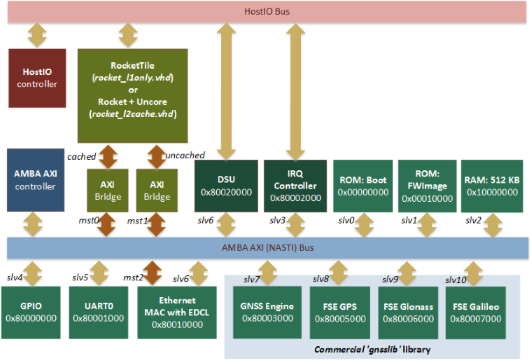
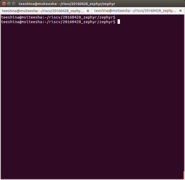

System-On-Chip template based on Rocket-chip (RISC-V ISA). VHDL implementation.
=====================

This repository provides open source System-on-Chip implementation based on
64-bits CPU "Rocket-chip" distributed under BSD license. SOC source files
either include general set of peripheries, FPGA CADs projects files, own
implementation of the Windows/Linux debugger and several examples that help
to run your firmware on almost any FPGA boards.
Satellite Navigation (GPS/GLONASS/Galileo) modules were stubbed in this
repository and can be requested on
[gnss-sensor.com](http://www.gnss-sensor.com).


## What is Rocket-chip and [RISC-V ISA](http://www.riscv.org)?

RISC-V (pronounced "risk-five") is a new instruction set architecture (ISA)
that was originally designed to support computer architecture research and
education and is now set become a standard open architecture for industry
implementations under the governance of the RISC-V Foundation. RISC-V was
originally developed in the Computer Science Division of the EECS Department
at the University of California, Berkeley.

Parameterized generator of the Rocket-chip can be found here:
[https://github.com/ucb-bar](https://github.com/ucb-bar)

## System-on-Chip structure and performance



Performance analysis is based on
[**Dhrystone v2.1. benchmark**](http://fossies.org/linux/privat/old/dhrystone-2.1.tar.gz/)
that is very compact and entirely ported into Zephyr shell example.
You can run it yourself and verify results (see below).

**RISC-V Instruction simulator**. Always one instruction per clock.

    Microseconds for one run through Dhrystone:     12.0
    Dhrystones per Second:                       77257.0

**FPGA SOC based on "Rocket-chip" CPU**. Single core/single issue CPU
with disabled L1toL2 interconnect.

    Microseconds for one run through Dhrystone:     28.0
    Dhrystones per Second:                       34964.0

Access to all memory banks and peripheries in the same clock domain is always
one clock in this SOC (without wait-states). So, this benchmark shows
performance of the CPU with integer instructions and degradation of the CPI
relative ideal case.


## Repository structure

This repository consists of three sub-projects each in own subfolder:

- **rocket_soc** is the folder with VHDL/Verilog sources of the SOC
  including synthesizable *"Rocket-chip"* processor and peripheries. 
  Source code is portable on almost any FPGA is due to the fact that
  technology dependant modules (like *PLL*, *IO-buffers* 
  etc) instantiated inside of "virtual" components 
  in a similar to Gailser's *[GRLIB](www.gailser.com)* way.  
  Full SOC design without FPU occupies less than 5 % of FPGA resources (Virtex6). 
  *"Rocket-chip"* CPU itself is the modern **64-bits processor 
  with L1-cache, branch-predictor, MMU and virtualization support**.  
  This sub-project also contains:
    * *fw*: directory with the bootloader and FW examples.
    * *fw_images*: directory with the ROM images in HEX-format.
    * *prj*: project files for different CADs (Xilinx ISE, ModelSim).
    * *tb*: VHDL testbech of the full system and utilities.
- **zephyr** is the ported (by me) on RISC-V 64-bits operation system.
  Information about this Real-Time Operation System for Internet of
  Things Devices provided by [Zephyr Project](https://www.zephyrproject.org/).
  Early support for the Zephyr Project includes Intel Corporation,
  NXP Semiconductors N.V., Synopsys, Inc. and UbiquiOS Technology Limited.
- **debugger**. The last piece of the ready-to-use open HW/SW system is
  [Software Debugger (C++)](http://sergeykhbr.github.io/riscv_vhdl/dbg_link.html)
  with the system simulator available as a plug-in (either as GUI
  or any other extension). Debugger interacts with the target (FPGA or
  Simulator) via [Ethernet](http://sergeykhbr.github.io/riscv_vhdl/eth_link.html)
  using EDCL protocol over UDP. To provide this functionality SOC includes
  [**10/100 Ethernet MAC with EDCL**](http://sergeykhbr.github.io/riscv_vhdl/eth_link.html)
  and [**Debug Support Unit (DSU)**](http://sergeykhbr.github.io/riscv_vhdl/dsu_link.html)
  devices on AMBA AXI4 bus.

## Step-by-step tutorial of how to run Zephyr-OS on FPGA board with synthesizable RISC-V processor.

To run provided **shell** application as on the animated picture bellow, we should do
several steps:

1. Setup GCC toolchain
2. Build Zephyr elf-file (shell example) and generate HEX-image to
   initialize ROM so that our FPGA board was ready to use without additional
   reprogram.
3. Build FPGA bitfile from VHDL/Verilog sources and program FPGA.
4. Install CP210x USB to UART bridge driver (if not installed yet) and
   connect to serial port of the SOC.
5. Final result should look like this:



### 1. Setup GCC toolchain

  You can find step-by-step instruction of how to build your own
toolchain on [riscv.org](http://riscv.org/software-tools/). If you would like
to use pre-build GCC binary files and libraries you can download it here:

   [Ubuntu GNU GCC 5.1.0 toolchain RV64IMA (256MB)](http://www.gnss-sensor.com/index.php?LinkID=1013)

  Feature of this GCC build is the configuration *RV64IMA* (without FPU).
Default toolchain configuration generates makefile with hardware FPU that
makes *libc* library incompatible with the *_-msoft-float_* compiler key.

  Just after you download the toolchain unpack it and set environment variable
as follows:

    $ tar -xzvf gnu-toolchain-rv64ima.tar.gz gnu-toolchain-rv64ima
    $ export PATH=/home/your_path/gnu-toolchain-rv64ima/bin:$PATH

If you would like to generate hex-file used for ROM initialization you probably
need tool *'elf2raw'* and *'libfesvr.so'* library that are not part of the GCC
toolchain. I've put them into *'libexttools'* sub-folder and to use them your
should copy files into *usr/bin* directory or define environment variable:

    $ export LD_LIBRARY_PATH=/home/your_path/gnu-toolchain-rv64ima/libexttools

### 2. Build Zephyr OS

Build elf-file:

    $ export ZEPHYR_BASE=/home/<repository_path>/zephyr/
    $ cd zephyr/samples/shell
    $ make ARCH=riscv64 CROSS_COMPILE=/home/your_path/gnu-toolchain-rv64ima/bin/riscv64-unknown-elf- BOARD=riscv_gnss 2>&1 | tee _err.log

Create HEX-image for ROM initialization. I use own analog of the *elf2raw*
utility named as *elf2raw64*. You can find it in GNU tools archive.

    $ elf2raw64 outdir/zephyr.elf -h -f 262144 -o fwimage.hex

Copy *fwimage.hex* to rocket_soc subdirectory

    $ cp fwimage.hex ../../../rocket_soc/fw_images

### 3. Build FPGA bitfile for ML605 board (Virtex6)

- Open project file for Xilinx ISE14.7 *prj/ml605/rocket_soc.xise*.
- Edit configuration constants in file **work/comfig_common.vhd** if needed.
  (Skip this step by default).
- Generate bit-file and load it into FPGA.

### 4. Connecting to serial port

Usually I use special client to interact with target but in general case
let's use standard Ubuntu utility 'screen'

    $ sudo apt-get install screen
    $ sudo screen /dev/ttyUSB0 115200

Use button "*Center*" to reset FPGA system and reprint initial messages:

```
    Boot . . .OK
    Zephyr version 1.3.0
    shell>
```

Our system is ready to use. Shell command **pnp** prints SOC HW information,
command **dhry** runs Dhrystone 2.1 benchmark.
To end the session, use Ctrl-A, Shift-K

## Simulation with ModelSim

1. Open project file *prj/modelsim/rocket.mpf*.
2. Compile project files.
3. If you get an errors for all files remove and re-create the following
   libraries in ModelSim library view:
     * techmap
     * ambalib
     * commonlib
     * rocketlib
     * gnsslib
     * work (was created by default)
4. Use *work/tb/rocket_soc_tb.vhd* to run simulation.
5. Testbench allows to check the following things:
     * LEDs switching
     * UART output
     * Interrupt controller
     * UDP/EDCL transaction via Ethernet
     * Access to CSR via Ethernet + DSU.
     * and other.


## Debugger

Since revision v2.0 we provide open source platform debugger. The pre-built
binaries can be downloaded [here](http://www.gnss-sensor.com/index.php?LinkID=15).
Instruction of how to connect FPGA board via
[Ethernet](http://sergeykhbr.github.io/riscv_vhdl/eth_link.html)
your can find here.
Just after successful connection with FPGA target your can interact
with RISC-V SOC by reading/writing memory, CSR register or load
new elf-file.

```
    riscv# csr MCPUID
    CSR[f00] => 8000000000041101
        Base: RV64IAMS
    riscv# read 0x204 20
    [0000000000000200]:  00 00 02 13 00 00 01 93 00 00 01 13 .. .. .. ..
    [0000000000000210]:  .. .. .. .. .. .. .. .. 00 00 03 13 00 00 02 93
    riscv# exit
```

Full debugger configuration including plugins states is stored in file
**config.json**. You can manually define CSR names and addresses,
enable/disable platform specific functionality, specify files pathes etc.
Start debugger with command argument *-sim* to connect SOC PC-simulator
instead of FPGA board:

```
     ./../linuxbuild/bin/appdbg64g.exe -sim
     c:\myprj\rocket\debugger\bin\appdbg64g.exe -sim
```

This simulator is analog of *spike* tool that is part of tools
provided RISC-V community. But it's implemented as set of plugins for the
Core library where each plugin is an independent device functional model.
Set of created and connected devices through configuration JSON-file forms
SOC platform that can include any number of different devices, including
GNSS engine or whatever.
To get more information see
[debugger's description](http://sergeykhbr.github.io/riscv_vhdl/dbg_link.html).


## Build and run 'Hello World' example.

Build example:

    $ cd /home/your_path/rocket_soc/fw/helloworld/makefiles
    $ make

Run debugger console:

    $ ./git_path/debugger/linuxbuild/bin/riscvdbg

Load elf-file via Ethernet using debugger console:

    #riscv loadelf bin/helloworld

You should see something like:

```
    riscv# loadelf e:/helloworld
    [loader0]: Loading '.text' section
    [loader0]: Loading '.eh_frame' section
    [loader0]: Loading '.rodata.str1.8' section
    [loader0]: Loading '.rodata' section
    [loader0]: Loading '.data' section
    [loader0]: Loading '.sdata' section
    [loader0]: Loading '.sbss' section
    [loader0]: Loading '.bss' section
    [loader0]: Loaded: 42912 B
```

Just after image loading finished debugger clears reset CPU signal and starts
execution. This example prints only once UART message *'Hello World - 1'*,
so if you'd like to repeat test reload image using **loadelf** command.

Now you can also generate HEX-file for ROM initialization to do that
see other example with **bootrom** implementation

    $ cd rocket_soc/fw/boot/makefiles
    $ make
    $ cd ../linuxbuild/bin

Opened directory contains the following files:
- _bootimage_       - elf-file (not used by SOC).
- _bootimage.dump_  - disassembled file for the verification.
- *_bootimage.hex_* - HEX-file for the Boot ROM intialization.

You can also check *bootimage.hex* and memory dump for consistence:

    #riscv dump 0 8192 dump.hex hex

I hope your also have run firmware on RISC-V system successfully.

My usual FPGA setup is ML605 board and debugger that is running on Windows 7
from Visual Studio project, so other target configurations (linux + KC705)
could contain errors that are fixing with a small delay. Let me know if see one.


## Versions History

### Implemented functionality (v3.0)

To get branch *v3.0* use the following git command:

    $ git clone -b v3.0 https://github.com/sergeykhbr/riscv_vhdl.git

- Ported open source Real-Time Operation System for Internet of Things
  Devices provided by [Zephyr Project](https://www.zephyrproject.org/).
- Benchmark *Dhrystone v2.1* run on FPGA and Simulator with published results.
- Testmode removed. *'gnsslib'* fully disabled.
- Graphical User Interface (GUI) for the debugger based on QT-libraries
  with significantly increasing of the debugger functionality.

### Implemented functionality (v2.0)

To get branch *v2.0* use the following git command:

    $ git clone -b v2.0 https://github.com/sergeykhbr/riscv_vhdl.git

This release add to following features to *v1.0*:

- [**Debug Support Unit**](http://sergeykhbr.github.io/riscv_vhdl/dsu_link.html)
  (DSU) for the access to all CPU registers (CSRs).
- [**10/100 Ethernet MAC with EDCL**](http://sergeykhbr.github.io/riscv_vhdl/eth_link.html)
  that allows to debug processor from the
  reset vector redirecting UDP requests directly on system bus.
- GNSS engine and RF-mezzanine card support.
- **Test Mode** (DIP[0]=1) that allows to use SOC with or without
  *RF-mezzanine card*.
- Master/Slave AMBA AXI4 interface refactoring.
- [**Debugger Software (C++)**](http://sergeykhbr.github.io/riscv_vhdl/dbg_link.html)
  for Windows and Linux with built-in simulator and plugins support.
- Portable asynchronous FIFO implementation allowing to connect modules to the
  System BUS from a separate clock domains (ADC clock domain):
- A lot of system optimizations.


### Implemented functionality (v1.0)

The initial *v1.0* release provides base SOC functionality with minimal
set of peripheries. To get this version use:

    $ git clone -b v1.0 https://github.com/sergeykhbr/riscv_vhdl.git

- Proof-of-concept VHDL SOC based on Verilog generated core *"Rocket-chip"*.
- Peripheries with AMBA AXI4 interfaces: GPIO, LEDs, UART, IRQ controller etc.
- Plug'n-Play support.
- Configuration and constraint files for ML605 (Virtex6) and KC705 (Kintex7)
  FPGA boards.
- Bit-files for ML605 and KC705 boards.
- Pre-built ROM images with the BootLoader and FW-image. FW-image is copied
  into internal SRAM during boot-stage.
- *"Hello World"* example.


## Doxygen project documentation

[http://sergeykhbr.github.io/riscv_vhdl/](http://sergeykhbr.github.io/riscv_vhdl/)
