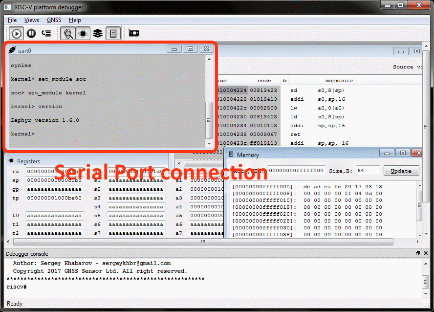
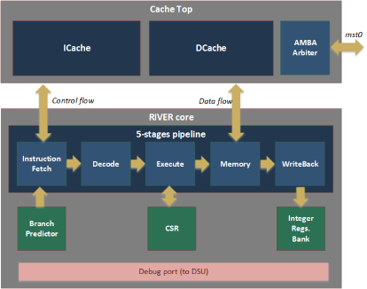

System-On-Chip template based on synthesizable processor compliant with the RISC-V architecture.
=====================

This repository provides open source System-on-Chip implementation based on
open source RISC-V specifications. SOC project
includes general set of peripheries, FPGA CADs projects files, own
implementation of the Windows/Linux debugger and several examples that help
to run your firmware on almost any FPGA boards.
Satellite Navigation (GPS/GLONASS/Galileo) modules were stubbed in this
repository and can be requested separately.

## What is River CPU?

That's a VHDL RISC-V ISA implementation used in a several projects including
the multi-sytem Satellite Navigation receiver. It is great for an 
embedded applications with active usage of 64-bits computations (like DSP).  
**River CPU** includes the following tools and features:

1. Source code
    - */debugger/cpu_fnc_plugin*  - Functional RISC-V CPU model.
    - */debugger/cpu_sysc_plugin* - Precise SystemC RIVER CPU model.
    - */rtl/riverlib*      -  synthesisable VHDL model of a 64-bit processor compliant with the RISC-V architecture.
2. Floating Point Unit (FPU)
3. Multi-Core configuration
4. Advanced debugging features
    - Test Access Points (TAPs) via Ethernet, UART and JTAG in one system.
    - Compatible with the Standard RISC-V debug specification.
    - System Bus tracer
    - Pipeline statistic (CPI, HW stacktrace) in a real-time on HW level.
    - Plug'n'Play information

You can find several **demonstration videos**
[here](https://github.com/sergeykhbr/riscv_vhdl/tree/master/debugger) of working with the 
Dual-Core SoC on FPGA and with the emulated platforms.

## System-on-Chip structure

SoC documentation in [.pdf](docs/riscv_vhdl_trm.pdf) formats.

## Performance

Performance analysis is based on very compact
[**Dhrystone v2.1. benchmark**](http://fossies.org/linux/privat/old/dhrystone-2.1.tar.gz/)
application available as the bare-metal test in *$(TOP)/example/dhrystone21*
folder and entirely ported into Zephyr shell (see animated gif below). Benchmark was executed
with enabled (-O0) and disabled (-O2) optimization to define HW and GCC-compiler advantages.
All sources are available and could be run on the simulator or on the 
different FPGA targets.

Target             | Git tag | Dhrystone  per sec,  -O0, 60 MHz | Dhrystone  per sec,  -O2, 60 MHz | Information.
-------------------|:-------:|:------------------------------:|:------------------------------:|:------------
RISC-V simulator   | latest  | **76824.0** | **176469.0**  | *GCC 7.1.1* with the compressed instructions set.
RISC-V simulator   | latest  | **77719.0** | **184074.0**  | *GCC 8.3.1* with the compressed instructions set.
"River" CPU        | latest  | **48581**   | **135432.0**  | *GCC 8.3.1* with the compressed instructions set.
ARM simulator      | latest  | **78451.0** | **162600.0**  | *arm-none-eabi-gcc 7.2.0*, ARM ISA only.
Cortex-R5 ARM      | No      | **20561.0** | **42401.0**   | *arm-none-eabi-gcc 7.2.0*, custom FPGA system:  Single-Core, MPU enabled, **Caches disabled**.
Cortex-R5 ARM      | No      | **54052.0** | **132446.0**  | *arm-none-eabi-gcc 7.2.0*, custom FPGA system:  Single-Core, MPU enabled, **Caches enabled**.
Cortex-M3 Thumb2   | [arm_vhdl](https://github.com/sergeykhbr/arm_vhdl) | soon       | soon          | *arm-none-eabi-gcc 7.2.0*, custom FPGA system
"LEON3" SPARC V8   | No      | **48229.0** | **119515.0**  | *sparc-elf-gcc 4.4.2*, custom FPGA system.

Access to all memory banks and peripheries for all targets (including ARM and Leon3) is made 
in the same clock domain and always is one clock (without wait-states).
So, this benchmark  result (**Dhrystone per seconds**) shows performance of 
the CPU with integer instructions and degradation of the CPI relative ideal 
(simulation) case.

CPU         | Clocks-Per-Instruction,  CPI | Description.
------------|:-------:|:------------------------------
Cortext-R5  | 1.22    | This is **dual-issue** processor capable to execute a pair of instructions per  one clock. It's a very good but quite expensive CPU.
LEON3       | 1.5     | CPI information from [here](https://www.gaisler.com/index.php/products/simulators/tsim).
River       | 1.35    | Free-to-use and highly customizable CPU. I/D caches are enabled: 4-ways, 16 KB each. [Reference Manual](docs/riscv_vhdl_trm.pdf).
Cortex-M3   | soon    | RTL is under development.

   **Since the tag 'v7.0' RIVER CPU is the main processor in the system and all issues
     related to Rocket-chip instance will be supported only by request.**

## Repository structure

This repository consists of three sub-projects each in own subfolder:

- **rtl** is the folder with VHDL/Verilog sources of the SOC
  including synthesizable processors *"Rocket"* and *"River"* and peripheries. 
  Source code is portable on almost any FPGA is due to the fact that
  technology dependant modules (like *PLL*, *IO-buffers* 
  etc) instantiated inside of "virtual" components 
  in a similar to Gailser's *[GRLIB](www.gailser.com)* way.  
  Full SOC design without FPU occupies less than 5 % of FPGA resources (Virtex6). 
  *"Rocket-chip"* CPU itself is the modern **64-bits processor 
  with L1-cache, branch-predictor, MMU and virtualization support**.  
  This sub-project also contains:
    * *fw_images*: directory with the ROM images in HEX-format.
    * *prj*: project files for different CADs (Xilinx ISE, ModelSim).
    * *tb*: VHDL testbech of the full system and utilities.
    * *bit_files*: Pre-built FPGA images for ML605 and KC705 boards.
- **examples** folder contains several C-examples that could help start working
  with the RISC-V system:
    * *boot* is the code of the Boot Loader. It is also used for the SRAM 
      initialization with the FW image and it allows to run examples on
      FPGA without using the debugger and external flash memory.
    * *helloworld* the simplest example with UART output.
    * *isrdemo* example with 1 second interrupt from timer and debug output.
    * *zephyr* is ported on RISC-V 64-bits operation system.
      Information about this Real-Time Operation System for Internet of
      Things Devices provided by [Zephyr Project](https://www.zephyrproject.org/).
      Early support for the Zephyr Project includes Intel Corporation,
      NXP Semiconductors N.V., Synopsys, Inc. and UbiquiOS Technology Limited.
- **debugger**. The last piece of the ready-to-use open HW/SW system is
  [Software Debugger (C++)](http://sergeykhbr.github.io/riscv_vhdl/sw_debugger_api_link.html)
  with the full system simulator available as a plug-in.
  Debugger interacts with the target (FPGA or Software Simulator) 
  via [Ethernet](http://sergeykhbr.github.io/riscv_vhdl/eth_link.html)
  using EDCL protocol over UDP. To provide this functionality SOC includes
  [**10/100 Ethernet MAC with EDCL**](http://sergeykhbr.github.io/riscv_vhdl/eth_link.html)
  and [**Debug Support Unit (DSU)**](http://sergeykhbr.github.io/riscv_vhdl/periphery_page_1.html)
  devices on AMBA AXI4 bus.

# Step I: Simple FPGA test.

You can use the pre-built FPGA image (for Xilinx ML605 or KC705 board) and any serial
console application (*putty*, *screen* or other) to run Dhrystone v2.1 benchmark as 
on the animated picture below.

1. Unpack and load file image *riscv_soc.bit* from */rtl/bit_files/* into FPGA board.
2. Connect to serial port. I used standard console utility *screen* on Ubuntu.

        $ sudo apt-get install screen
        $ sudo screen /dev/ttyUSB0 115200

3. Use button "*Center*" to reset FPGA system and reprint initial messages (or just press Enter):

To end the session, use *Ctrl-A*, *Shift-K*

# Step II: Build and run Software models with GUI.

How to build simulator from  scratch see [here](https://github.com/sergeykhbr/riscv_vhdl/tree/master/debugger)

It should look like the following:

  

There's dependency of two others open source projects:

* **[Qt-libraries](https://www.qt.io/download/)**
* **[SystemC library](http://accellera.org/downloads/standards/systemc)**

# Step III: Build FPGA image

Default VHDL configuration enables River CPU with full debug support.

1. Open ML605 project file for Xilinx ISE14.7 *prj/ml605/riscv_soc.xise*
   or KC705 project file for Xilinx Vivado *prj/kc705/riscv_soc.xpr*.
2. Edit configuration constants in file **work/config_common.vhd** if needed.
   (Skip this step by default).
3. Use *rtl/work/tb/riscv_soc_tb.vhd"* testbench file to verify
   full system including *CPU*, *UART*, *Timers*, *Ethernet*, *GPIO* etc.
4. Generate bit-file and load it into FPGA.

## Doxygen project documentation

[http://sergeykhbr.github.io/riscv_vhdl/](http://sergeykhbr.github.io/riscv_vhdl/)
