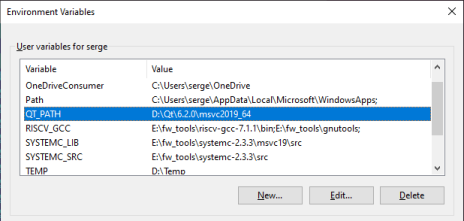
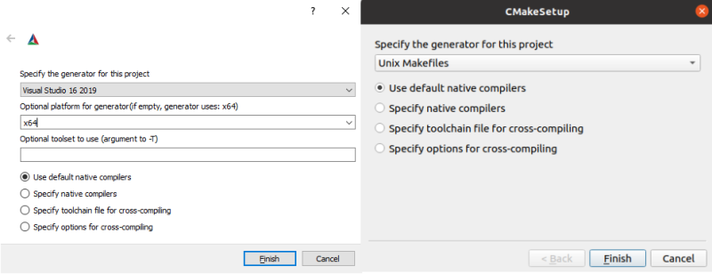
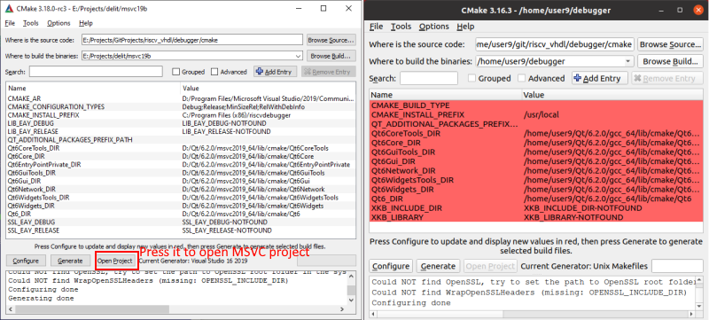
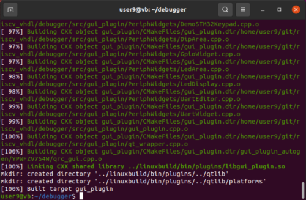
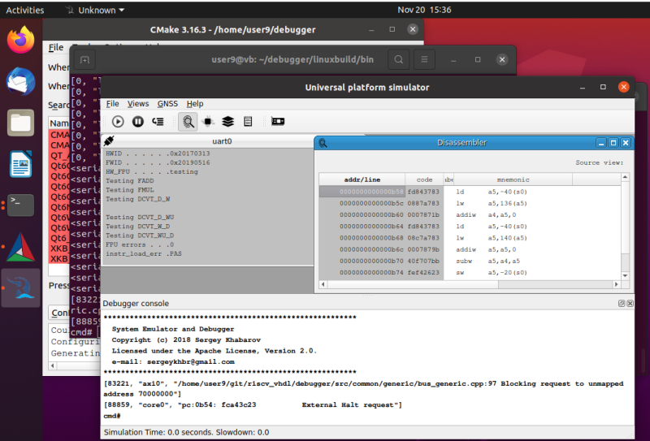

Universal Platform Simulator and Debugger.
=====================

This repository folder contains source code of the Unversal Platform Simulator
with the following capabilities:

- Functional simulation of the RISC-V based system
- SystemC simulation of the RISC-V based system
- Mixed Hardware and software co-simulation
- OpenOCD bitband interface
- Python connection through the TCP interface
- Windows and Linux portable using CMake files

JSON-configuration files in sub-folder *./targets* defines the structure
and capabilities of the running platform:

## Howto build:

1. Install building toolchain
   - Windows: download and install MS Visual Studio community version
   - Linux:

        $ sudo apt-get install build-essential

2. Install cmake-gui
   - Windows: download and install cmake-gui from "https://cmake.org/download/"
   - Linux:

        $ sudo apt-get install cmake-qt-gui

   - Clean Ubuntu 20.04 version also required to install OpenGl drivers:

        $ sudo apt-get install mesa-common-dev libxcb-xinerama0

3. Install the latest Qt-Libraries (checked with 6.2) using online installer.
4. Define environment variable QT_PATH accordingly with your installation path

   - Windows: 

   - Linux:

        $ export QT_PATH=/home/user/Qt/6.2.0/gcc_64

5. Define environment variables SYSTEMC_SRC and SYSTEMC_LIB (in the same way as for Qt).
   For this download SystemC from [here](https://www.accellera.org/downloads/standards/systemc):

5.1. Build SystemC library on Windows

- Generate MSVC project using cmake-gui utility
- Change default "Configuration Properties"->"C/C++"->"All Options"->"Runtime Library" = Multi-threaded DLL (/MD)
- Build solution
- Define env. variables SYSTEMC_SRC and SYSTEMC_LIB as on picture above.

5.2. Build systemc library on Linux

        $ tar -xvzf systemc-2.3.1a.tar.gz
        $ cd systemc-2.3.1a
        $ mkdir tmp
        $ cd tmp
        $ ./../configure --prefix=/home/user/systemc-2.3.1a/build
        $ make
        $ make install
        $ export SYSTEMC_SRC=/home/user/systemc-2.3.1a/build/include/")
        $ export SYSTEMC_LIB=/home/user/systemc-2.3.1a/build/lib-linux64/")

6. Generate MSVC project for Windows or makefiles for Linux

- Specify (1) folder containing debugger's cmake files
- Specify (2) any diretory where you would like to have build project
- Press button 3, 4 (or 4).
- The very first configuration cmake will request additional target information:

7. Build and run generated project

In a case of successful project generation:

   - Windows: Press the button "Open Project" then build and run debugger from Visual Studio
   - Linux: Goto into the generated project folder and build makefiles:

        $ cd ~/debugger
        $ make

To start debugger on Linux (the same on Windows with winbuild/bin):

        $ cd linuxbuild/bin
        $ ./_run_func_river_x1_gui.sh

That's all!

## Debugging Dual-Core River CPU SoC on FPGA ML605 board

Brief video description:

  - Core[0] runs Zephyr 6.0
  - Core[1] goes into the Idle Cycle (see examples/boot/) just after init.
  - Manually run OS tests and Drhystone on Core[0] while Core[1] is running and halted
  - Change *npc* register on Core[1] to start function *timestamp_output*
  - Run two cores in parallel and check HW statistic graphs.

Information:

  - Source code of everything from this video is already in this repository.
  - Used tools: Xilinx ISE Studio, GCC compiler with debug symbols

## Simulation of the ARMv7 processor based system

Brief video description:

  - Showing system features: display, buttons, LEDs, ADC channel
  - Debugging features: symbol browser, code stepping, breakpoints
  - Interaction with emulated ARM processor from GUI
  - Work with the Stack trace and symbols

Information:

  - This video shows system that doesn't exist in the real world as the HW board
  - Not all components of the shown simulation platform available in this repository some 
    of them provided only by request
  - Used tools: GCC compiler for ARM

## Siemens C167 processor based platform emulation (16-bits) video

Brief video description:

  - In this video is used *Digital Twin* (precise simulation platform) of the 
    real medical device
  - Simulation provides access to all standard debugging features plus additional
    capability to emulate hardware faults.
  

Information:

  - Custom platform includes many not published device models: motors, LED displays, analog sensors etc.
  - Keil compiler
  - MAP-file with debug information to load the symbols

## Motorola HC08 processor based platform (8-bits) video

Information:

  - Custom platform includes many not published device models: motors, LED displays, analog sensors etc.
  - CasmHCS08 Pro compiler
  - Binary MAP-file with debug information to load the symbols

